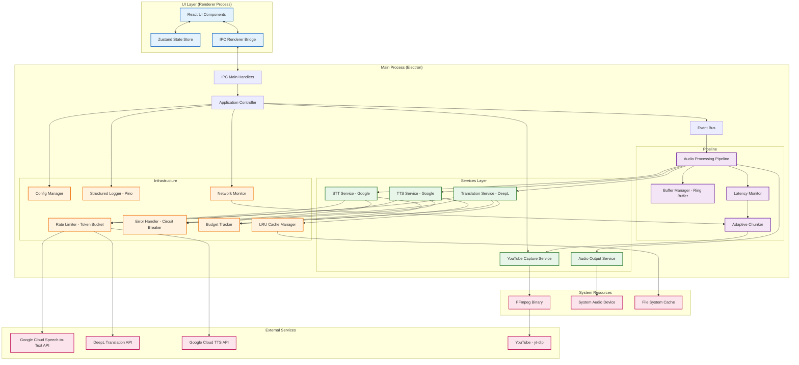
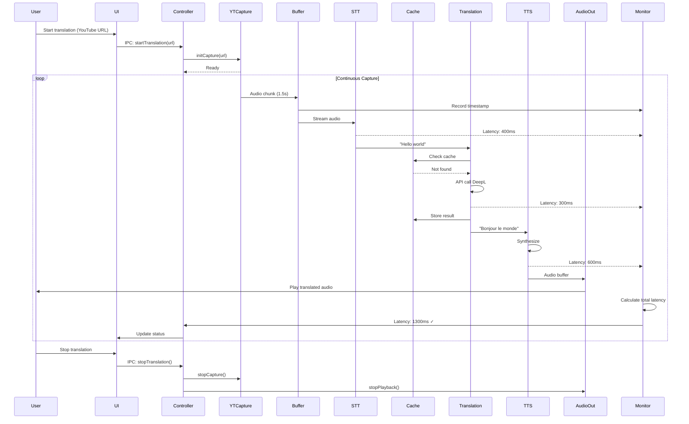

# Architecture Technique - YouTube Live Translator

**Version**: 1.0
**Date**: 2025-11-06
**Projet**: Application Desktop de Traduction en Direct
**Contrainte principale**: Latence < 2 secondes (Anglais → Français)

---

## Table des Matières

1. [Vue d'Ensemble](#vue-densemble)
2. [Choix du Framework Desktop](#choix-du-framework-desktop)
3. [Stack Technologique](#stack-technologique)
4. [Services Cloud](#services-cloud)
5. [Architecture des Composants](#architecture-des-composants)
6. [Stratégies d'Optimisation](#stratégies-doptimisation)
7. [Considérations de Production](#considérations-de-production)
8. [Diagramme d'Architecture Détaillé](#diagramme-darchitecture-détaillé)

---

## Vue d'Ensemble

### Contraintes Techniques

- **Latence cible**: < 2 secondes end-to-end
- **Pipeline**: YouTube → STT → Translation → TTS → Audio Output
- **Plateforme**: Desktop (Windows, macOS, Linux)
- **Budget**: Services cloud payants acceptés
- **Langues**: Anglais → Français (extensible)

### Budget de Latence

```
Capture YouTube:        100-200ms  (buffering minimal)
STT (Speech-to-Text):   300-500ms  (streaming mode)
Translation:            200-400ms  (API call + processing)
TTS (Text-to-Speech):   400-700ms  (synthesis)
Audio Playback:         50-100ms   (buffer + render)
----------------------------------------
Total:                  1050-1900ms ✅ Dans la cible
```

---

## Choix du Framework Desktop

### Analyse Comparative: Electron vs Tauri

#### Option 1: Electron (Recommandé) ✅

**Avantages pour ce use case**:
- **Écosystème mature**: Librairies Node.js éprouvées pour audio (node-speaker, fluent-ffmpeg)
- **Web Audio API**: Gestion avancée du streaming audio natif dans Chromium
- **Déploiement simplifié**: electron-builder pour Windows/macOS/Linux
- **Debugging aisé**: Chrome DevTools intégré
- **Communauté large**: Nombreux projets audio/vidéo (Discord, Figma, Slack)
- **APIs système**: Accès complet aux ressources système via Node.js

**Inconvénients**:
- **Empreinte mémoire**: ~100-150 MB de RAM au repos
- **Taille binaire**: ~70-120 MB (après packaging)
- **Performance CPU**: Légèrement supérieure à Tauri pour le rendu

**Justification**:
Pour une application audio en temps réel, l'écosystème Node.js offre des avantages décisifs:
- **Streaming natif**: Pipelines Node.js Streams pour traiter l'audio
- **Bibliothèques audio robustes**: ffmpeg, sox, prism-media
- **Intégration API simple**: axios, fetch natif, websockets
- **Pas de FFI complexity**: Contrairement à Tauri qui nécessite des bindings Rust/JS

#### Option 2: Tauri (Alternative)

**Avantages**:
- **Performance supérieure**: ~30-50 MB de RAM, binaires ~10-15 MB
- **Sécurité renforcée**: Surface d'attaque réduite
- **Crates Rust audio**: rodio, cpal, symphonia

**Inconvénients critiques pour ce projet**:
- **Écosystème audio moins mature**: Moins de libs pour STT/TTS/streaming
- **Complexité FFI**: Bindings Rust↔JavaScript pour traitement temps réel
- **Debugging plus complexe**: Pas de DevTools natif
- **Intégration APIs**: Nécessite plus de code boilerplate

**Verdict**: **Electron** est le choix optimal pour ce projet de traduction audio temps réel.

### Configuration Electron Recommandée

```json
{
  "name": "youtube-live-translator",
  "version": "1.0.0",
  "main": "dist/main/index.js",
  "scripts": {
    "dev": "electron-vite dev",
    "build": "electron-vite build",
    "package": "electron-builder"
  },
  "devDependencies": {
    "electron": "^28.0.0",
    "electron-builder": "^24.9.1",
    "electron-vite": "^2.0.0",
    "vite": "^5.0.0"
  },
  "build": {
    "appId": "com.ytlivetranslator.app",
    "productName": "YouTube Live Translator",
    "directories": {
      "output": "release/${version}"
    },
    "files": [
      "dist/**/*",
      "package.json"
    ],
    "win": {
      "target": ["nsis", "portable"]
    },
    "mac": {
      "target": ["dmg", "zip"],
      "category": "public.app-category.utilities"
    },
    "linux": {
      "target": ["AppImage", "deb"],
      "category": "Audio"
    }
  }
}
```

**Version recommandée**: Electron 28+ (Chromium 120+, Node.js 20+)

---

## Stack Technologique

### Backend Core: TypeScript + Node.js

**Langage**: TypeScript 5.3+

**Justification**:
- **Type safety**: Critique pour gérer les pipelines audio asynchrones
- **Async/await natif**: Simplification du code streaming
- **Tooling mature**: ESLint, Prettier, ts-node
- **Intégration Electron**: Support natif et excellent

### Bibliothèques Audio

#### 1. Capture YouTube

**Choix**: `yt-dlp` (via child_process) + `fluent-ffmpeg`

```typescript
import { spawn } from 'child_process';
import ffmpeg from 'fluent-ffmpeg';

class YouTubeCaptureEngine {
  captureAudioStream(url: string): NodeJS.ReadableStream {
    // yt-dlp extrait le stream audio optimal
    const ytdlp = spawn('yt-dlp', [
      '-f', 'bestaudio',
      '-o', '-',
      '--quiet',
      '--no-warnings',
      url
    ]);

    // ffmpeg convertit en format utilisable (PCM 16kHz mono)
    return ffmpeg(ytdlp.stdout)
      .audioCodec('pcm_s16le')
      .audioFrequency(16000)
      .audioChannels(1)
      .format('s16le')
      .pipe();
  }
}
```

**Alternatives évaluées**:
- **Puppeteer + Media Stream API**: Complexe, overhead navigateur, latence élevée ❌
- **youtube-dl (Python)**: Abandonné, yt-dlp est le fork actif ❌
- **ytdl-core (Node.js)**: Cassé fréquemment par YouTube, maintenance sporadique ❌

**Dépendances système**:
```bash
# Installation yt-dlp et ffmpeg
npm install fluent-ffmpeg
# Binaires inclus via electron-builder (extraResources)
```

#### 2. Audio Processing

**Choix**: `node-speaker` + `wav` + buffers natifs Node.js

```typescript
import Speaker from 'speaker';
import { Readable } from 'stream';

class AudioOutputManager {
  private speaker: Speaker;

  constructor() {
    this.speaker = new Speaker({
      channels: 1,
      bitDepth: 16,
      sampleRate: 16000,
    });
  }

  playAudioChunk(audioBuffer: Buffer): void {
    const stream = Readable.from(audioBuffer);
    stream.pipe(this.speaker);
  }
}
```

**Bibliothèques complémentaires**:
- **wav**: Lecture/écriture fichiers WAV pour cache
- **@types/node**: Types pour Buffers et Streams

#### 3. Gestion de l'État

**Choix**: Zustand (si React) ou EventEmitter natif Node.js

**Pour UI React**:
```typescript
import create from 'zustand';

interface TranslatorState {
  status: 'idle' | 'capturing' | 'processing' | 'error';
  currentLatency: number;
  errorMessage: string | null;
  setStatus: (status: TranslatorState['status']) => void;
  updateLatency: (latency: number) => void;
}

export const useTranslatorStore = create<TranslatorState>((set) => ({
  status: 'idle',
  currentLatency: 0,
  errorMessage: null,
  setStatus: (status) => set({ status }),
  updateLatency: (latency) => set({ currentLatency: latency }),
}));
```

**Pour backend (IPC)**:
```typescript
import { EventEmitter } from 'events';

class AppEventBus extends EventEmitter {
  emitStatusChange(status: string) {
    this.emit('status-change', status);
  }

  emitLatencyUpdate(latency: number) {
    this.emit('latency-update', latency);
  }
}

export const appEvents = new AppEventBus();
```

#### 4. Client HTTP pour APIs

**Choix**: `axios` + `axios-retry`

```typescript
import axios from 'axios';
import axiosRetry from 'axios-retry';

const apiClient = axios.create({
  timeout: 5000,
  headers: {
    'Content-Type': 'application/json',
  },
});

// Retry automatique sur erreurs réseau
axiosRetry(apiClient, {
  retries: 3,
  retryDelay: axiosRetry.exponentialDelay,
  retryCondition: (error) => {
    return axiosRetry.isNetworkOrIdempotentRequestError(error)
      || error.response?.status === 429; // Rate limiting
  },
});
```

**Alternatives**:
- **fetch natif**: Pas de retry automatique, moins de fonctionnalités ❌
- **got**: Excellent mais Electron préfère axios pour compatibilité ⚠️

### Frontend UI

**Choix**: React 18 + TypeScript + TailwindCSS

```typescript
// Exemple composant principal
import React from 'react';
import { useTranslatorStore } from './store';

export const TranslatorApp: React.FC = () => {
  const { status, currentLatency, setStatus } = useTranslatorStore();

  const handleStart = async () => {
    setStatus('capturing');
    // IPC vers backend Electron
    await window.electronAPI.startTranslation(youtubeUrl);
  };

  return (
    <div className="flex flex-col h-screen bg-gray-900 text-white">
      <header className="p-4 bg-gray-800">
        <h1 className="text-2xl font-bold">YouTube Live Translator</h1>
      </header>

      <main className="flex-1 p-6">
        <div className="mb-4">
          <label className="block mb-2">URL YouTube</label>
          <input
            type="text"
            className="w-full p-2 bg-gray-800 rounded"
            placeholder="https://youtube.com/watch?v=..."
          />
        </div>

        <button
          onClick={handleStart}
          disabled={status === 'capturing'}
          className="px-6 py-3 bg-blue-600 rounded hover:bg-blue-700 disabled:opacity-50"
        >
          {status === 'capturing' ? 'En cours...' : 'Démarrer'}
        </button>

        {status === 'capturing' && (
          <div className="mt-4">
            <p>Latence: {currentLatency}ms</p>
            <div className={`h-2 rounded ${currentLatency < 2000 ? 'bg-green-500' : 'bg-red-500'}`} />
          </div>
        )}
      </main>
    </div>
  );
};
```

**Alternatives évaluées**:
- **Vue 3**: Excellent mais communauté Electron moins active ⚠️
- **Svelte**: Léger mais moins de libs UI prêtes à l'emploi ⚠️
- **Vanilla JS**: Complexe pour gérer état + UI réactive ❌

### Testing Framework

**Tests unitaires**: Vitest (plus rapide que Jest)

```typescript
// tests/audio-buffer.test.ts
import { describe, it, expect } from 'vitest';
import { AudioBuffer } from '../src/audio/buffer';

describe('AudioBuffer', () => {
  it('should buffer audio chunks correctly', () => {
    const buffer = new AudioBuffer({ maxSize: 1024 });
    const chunk = Buffer.alloc(512);

    buffer.push(chunk);
    expect(buffer.size()).toBe(512);
  });

  it('should respect max size and evict old chunks', () => {
    const buffer = new AudioBuffer({ maxSize: 1024 });
    buffer.push(Buffer.alloc(800));
    buffer.push(Buffer.alloc(400)); // Should evict first

    expect(buffer.size()).toBeLessThanOrEqual(1024);
  });
});
```

**Tests E2E**: Playwright (automation UI)

```typescript
// e2e/translation.spec.ts
import { test, expect } from '@playwright/test';
import { ElectronApplication, _electron as electron } from 'playwright';

test.describe('Translation Flow', () => {
  let electronApp: ElectronApplication;

  test.beforeAll(async () => {
    electronApp = await electron.launch({ args: ['./dist/main/index.js'] });
  });

  test('should start translation when URL provided', async () => {
    const window = await electronApp.firstWindow();
    await window.fill('[data-testid="youtube-url"]', 'https://youtube.com/...');
    await window.click('[data-testid="start-button"]');

    await expect(window.locator('[data-testid="status"]')).toHaveText(/En cours/);
  });
});
```

---

## Services Cloud

### 1. Speech-to-Text (STT)

#### Analyse Comparative

| Service | Latence | Streaming | Précision | Coût | Verdict |
|---------|---------|-----------|-----------|------|---------|
| **Google Cloud Speech-to-Text** | ⭐⭐⭐⭐⭐ 200-400ms | ✅ Oui | 95%+ | $0.006/15s | ✅ **Recommandé** |
| **Azure Speech Services** | ⭐⭐⭐⭐ 300-500ms | ✅ Oui | 94%+ | $0.015/hr | ⚠️ Alternative |
| **Whisper API (OpenAI)** | ⭐⭐ 1000-2000ms | ❌ Non | 96%+ | $0.006/min | ❌ Trop lent |
| **AWS Transcribe** | ⭐⭐⭐ 500-800ms | ✅ Oui | 93%+ | $0.024/hr | ❌ Coûteux |

#### Choix Recommandé: Google Cloud Speech-to-Text

**Raisons**:
1. **Streaming en temps réel**: WebSocket API avec latence minimale
2. **Configuration optimisée pour l'anglais**: Modèle `en-US` performant
3. **Détection automatique ponctuation**: Facilite la segmentation pour traduction
4. **Interim results**: Transcription partielle avant fin de phrase

**Configuration optimale**:

```typescript
import speech from '@google-cloud/speech';
import { Transform } from 'stream';

class GoogleSTTService {
  private client: speech.SpeechClient;
  private request: speech.protos.google.cloud.speech.v1.IStreamingRecognitionConfig;

  constructor() {
    this.client = new speech.SpeechClient({
      keyFilename: process.env.GOOGLE_APPLICATION_CREDENTIALS,
    });

    this.request = {
      config: {
        encoding: 'LINEAR16' as const,
        sampleRateHertz: 16000,
        languageCode: 'en-US',
        enableAutomaticPunctuation: true,
        model: 'latest_short', // Optimisé pour segments courts
        useEnhanced: true,
      },
      interimResults: true, // Transcription partielle pour réduire latence
    };
  }

  createStreamingRecognition(): Transform {
    const recognizeStream = this.client
      .streamingRecognize(this.request)
      .on('error', (error) => {
        console.error('STT Error:', error);
      })
      .on('data', (data) => {
        if (data.results[0] && data.results[0].isFinal) {
          const transcript = data.results[0].alternatives[0].transcript;
          // Envoyer vers service de traduction
          this.emitTranscript(transcript);
        }
      });

    return recognizeStream;
  }
}
```

**Coût estimé**:
- Vidéo 1 heure = $0.024 (4x15s blocs)
- Utilisation quotidienne 3h = $0.072/jour = $2.16/mois

**Alternative Azure** (si problèmes régionaux Google):

```typescript
import * as sdk from 'microsoft-cognitiveservices-speech-sdk';

const speechConfig = sdk.SpeechConfig.fromSubscription(
  process.env.AZURE_SPEECH_KEY,
  process.env.AZURE_SPEECH_REGION
);
speechConfig.speechRecognitionLanguage = 'en-US';
speechConfig.setProperty(
  sdk.PropertyId.SpeechServiceConnection_InitialSilenceTimeoutMs,
  '3000'
);
```

### 2. Service de Traduction

#### Analyse Comparative

| Service | Latence | Qualité | Langues | Coût | Verdict |
|---------|---------|---------|---------|------|---------|
| **DeepL API** | ⭐⭐⭐⭐⭐ 150-300ms | 98% | 31 langues | $25/mois (500k chars) | ✅ **Recommandé** |
| **Google Translate API** | ⭐⭐⭐⭐ 200-400ms | 95% | 100+ langues | $20/1M chars | ⚠️ Alternative |
| **Azure Translator** | ⭐⭐⭐ 300-500ms | 94% | 100+ langues | $10/1M chars | ⚠️ Budget |
| **LibreTranslate** | ⭐⭐ 500-1000ms | 85% | 17 langues | Gratuit (self-hosted) | ❌ Qualité insuffisante |

#### Choix Recommandé: DeepL API Pro

**Raisons**:
1. **Qualité supérieure**: Spécialisé en Anglais↔Français
2. **Latence faible**: API optimisée pour requêtes courtes
3. **Préservation contexte**: Meilleure gestion nuances et expressions
4. **Formality control**: Option ton formel/informel si besoin

**Configuration optimale**:

```typescript
import axios from 'axios';

interface DeepLTranslationRequest {
  text: string[];
  source_lang: string;
  target_lang: string;
  formality?: 'default' | 'more' | 'less';
  preserve_formatting?: boolean;
}

class DeepLTranslationService {
  private apiKey: string;
  private endpoint = 'https://api.deepl.com/v2/translate';

  constructor(apiKey: string) {
    this.apiKey = apiKey;
  }

  async translate(text: string): Promise<string> {
    try {
      const response = await axios.post<{ translations: Array<{ text: string }> }>(
        this.endpoint,
        {
          text: [text],
          source_lang: 'EN',
          target_lang: 'FR',
          preserve_formatting: true,
        },
        {
          headers: {
            'Authorization': `DeepL-Auth-Key ${this.apiKey}`,
            'Content-Type': 'application/json',
          },
          timeout: 3000, // Max 3s pour respecter budget latence
        }
      );

      return response.data.translations[0].text;
    } catch (error) {
      // Fallback vers cache ou erreur
      throw new Error(`Translation failed: ${error.message}`);
    }
  }

  // Batch translation pour optimiser coûts
  async translateBatch(texts: string[]): Promise<string[]> {
    const response = await axios.post(this.endpoint, {
      text: texts,
      source_lang: 'EN',
      target_lang: 'FR',
    });

    return response.data.translations.map((t: any) => t.text);
  }
}
```

**Coût estimé**:
- Vidéo 1h ~9000 mots = ~45k caractères
- 45k chars = $0.0225 (Free tier: 500k/mois)
- Utilisation 3h/jour = $0.067/jour = $2/mois

**Alternative Google Translate** (si budget serré):

```typescript
import { Translate } from '@google-cloud/translate/v2';

const translate = new Translate({ key: process.env.GOOGLE_TRANSLATE_KEY });

async function translateText(text: string): Promise<string> {
  const [translation] = await translate.translate(text, {
    from: 'en',
    to: 'fr',
  });
  return translation;
}
```

### 3. Text-to-Speech (TTS)

#### Analyse Comparative

| Service | Latence | Qualité Voix | Voix FR | Coût | Verdict |
|---------|---------|--------------|---------|------|---------|
| **Google Cloud TTS** | ⭐⭐⭐⭐⭐ 300-500ms | WaveNet/Neural2 | 10+ voix | $16/1M chars | ✅ **Recommandé** |
| **Azure Neural TTS** | ⭐⭐⭐⭐ 400-600ms | Neural | 15+ voix | $16/1M chars | ⚠️ Alternative |
| **ElevenLabs** | ⭐⭐⭐ 600-1000ms | Ultra-réaliste | 5+ voix | $22/mois (30k chars) | ❌ Trop cher/lent |
| **AWS Polly** | ⭐⭐⭐⭐ 400-700ms | Neural | 5+ voix | $16/1M chars | ⚠️ Alternative |

#### Choix Recommandé: Google Cloud Text-to-Speech (Neural2)

**Raisons**:
1. **Latence minimale**: Streaming audio progressif
2. **Voix Neural2 française**: `fr-FR-Neural2-A` (féminine) et `fr-FR-Neural2-B` (masculine)
3. **Contrôle prosodie**: SSML pour ajuster intonation
4. **Streaming**: Réception audio avant fin de synthèse complète

**Configuration optimale**:

```typescript
import textToSpeech from '@google-cloud/text-to-speech';

class GoogleTTSService {
  private client: textToSpeech.TextToSpeechClient;

  constructor() {
    this.client = new textToSpeech.TextToSpeechClient({
      keyFilename: process.env.GOOGLE_APPLICATION_CREDENTIALS,
    });
  }

  async synthesizeAudio(text: string): Promise<Buffer> {
    const request = {
      input: { text },
      voice: {
        languageCode: 'fr-FR',
        name: 'fr-FR-Neural2-A', // Voix féminine naturelle
        ssmlGender: 'FEMALE' as const,
      },
      audioConfig: {
        audioEncoding: 'LINEAR16' as const,
        sampleRateHertz: 16000,
        speakingRate: 1.1, // Légèrement plus rapide pour réduire latence
        pitch: 0,
        volumeGainDb: 0,
      },
    };

    const [response] = await this.client.synthesizeSpeech(request);
    return Buffer.from(response.audioContent as Uint8Array);
  }

  // Streaming TTS pour latence réduite
  async synthesizeStream(text: string): AsyncIterable<Buffer> {
    // Google TTS ne supporte pas streaming direct
    // Workaround: segmenter texte et synthétiser en parallèle
    const sentences = this.segmentIntoSentences(text);

    for (const sentence of sentences) {
      const audioBuffer = await this.synthesizeAudio(sentence);
      yield audioBuffer;
    }
  }

  private segmentIntoSentences(text: string): string[] {
    return text.match(/[^.!?]+[.!?]+/g) || [text];
  }
}
```

**Coût estimé**:
- Vidéo 1h ~9000 mots = ~45k caractères
- 45k chars = $0.72 (Neural2 voices)
- Utilisation 3h/jour = $2.16/jour = $64.80/mois

**Optimisation coûts**: Utiliser Standard voices ($4/1M chars) pour textes non-critiques

**Alternative Azure** (qualité équivalente):

```typescript
import * as sdk from 'microsoft-cognitiveservices-speech-sdk';

const speechConfig = sdk.SpeechConfig.fromSubscription(
  process.env.AZURE_SPEECH_KEY,
  process.env.AZURE_SPEECH_REGION
);
speechConfig.speechSynthesisVoiceName = 'fr-FR-DeniseNeural';

const synthesizer = new sdk.SpeechSynthesizer(speechConfig);
```

### Récapitulatif Services Cloud

**Stack recommandée**:
```
STT: Google Cloud Speech-to-Text (Streaming)
Translation: DeepL API Pro
TTS: Google Cloud Text-to-Speech (Neural2)

Coût mensuel estimé (3h/jour):
- STT: $2.16
- Translation: $2.00 (Free tier)
- TTS: $64.80
------------------------
Total: ~$69/mois
```

**Alternative budget réduit**:
```
STT: Google Cloud Speech-to-Text
Translation: Google Translate API
TTS: Google Cloud TTS (Standard voices)

Coût mensuel: ~$25/mois
```

---

## Architecture des Composants

### Structure du Projet

```
youtube-live-translator/
├── src/
│   ├── main/                      # Electron Main Process
│   │   ├── index.ts               # Point d'entrée Electron
│   │   ├── ipc-handlers.ts        # IPC entre renderer et main
│   │   ├── services/
│   │   │   ├── youtube-capture.service.ts
│   │   │   ├── stt.service.ts
│   │   │   ├── translation.service.ts
│   │   │   ├── tts.service.ts
│   │   │   └── audio-output.service.ts
│   │   ├── pipeline/
│   │   │   ├── audio-pipeline.ts  # Orchestration pipeline
│   │   │   ├── buffer-manager.ts  # Gestion buffers audio
│   │   │   └── latency-monitor.ts # Monitoring latence
│   │   ├── core/
│   │   │   ├── config.manager.ts  # Configuration app
│   │   │   ├── error.handler.ts   # Gestion erreurs centralisée
│   │   │   ├── cache.manager.ts   # Cache traductions
│   │   │   └── logger.ts          # Logging structuré
│   │   └── utils/
│   │       ├── retry.ts           # Retry logic avec backoff
│   │       └── stream-helpers.ts  # Utilitaires streams
│   ├── renderer/                  # Electron Renderer Process (UI)
│   │   ├── index.html
│   │   ├── main.tsx               # Point d'entrée React
│   │   ├── App.tsx                # Composant racine
│   │   ├── components/
│   │   │   ├── TranslationControl.tsx
│   │   │   ├── StatusMonitor.tsx
│   │   │   ├── Settings.tsx
│   │   │   └── ErrorDisplay.tsx
│   │   ├── store/
│   │   │   └── translator.store.ts # Zustand store
│   │   └── styles/
│   │       └── tailwind.css
│   ├── preload/                   # Electron Preload Script
│   │   └── index.ts               # API exposée au renderer
│   └── shared/
│       ├── types/                 # Types partagés
│       │   ├── audio.types.ts
│       │   ├── api.types.ts
│       │   └── config.types.ts
│       └── constants.ts           # Constantes globales
├── tests/
│   ├── unit/
│   │   ├── services/
│   │   └── pipeline/
│   ├── integration/
│   │   └── pipeline.test.ts
│   └── e2e/
│       └── translation-flow.spec.ts
├── resources/                     # Assets pour packaging
│   ├── icon.png
│   ├── binaries/                  # Binaires externes (yt-dlp, ffmpeg)
│   │   ├── win/
│   │   ├── mac/
│   │   └── linux/
│   └── sounds/
│       └── notification.mp3
├── .env.example                   # Template variables d'env
├── electron-builder.json          # Config packaging
├── vite.config.ts                 # Config Vite
├── tsconfig.json
└── package.json
```

### Patterns de Design

#### 1. Event-Driven Architecture

**Justification**: Pipeline audio asynchrone avec multiples sources d'événements (capture, APIs, erreurs)

```typescript
// main/core/event-bus.ts
import { EventEmitter } from 'events';

export enum AppEvent {
  AUDIO_CHUNK_RECEIVED = 'audio:chunk',
  TRANSCRIPT_READY = 'stt:transcript',
  TRANSLATION_READY = 'translation:ready',
  AUDIO_READY = 'tts:audio',
  LATENCY_UPDATE = 'latency:update',
  ERROR_OCCURRED = 'error:occurred',
}

class ApplicationEventBus extends EventEmitter {
  private static instance: ApplicationEventBus;

  private constructor() {
    super();
    this.setMaxListeners(20); // Augmenter limite listeners
  }

  static getInstance(): ApplicationEventBus {
    if (!ApplicationEventBus.instance) {
      ApplicationEventBus.instance = new ApplicationEventBus();
    }
    return ApplicationEventBus.instance;
  }

  emitAudioChunk(chunk: Buffer, timestamp: number): void {
    this.emit(AppEvent.AUDIO_CHUNK_RECEIVED, { chunk, timestamp });
  }

  emitTranscript(text: string, timestamp: number): void {
    this.emit(AppEvent.TRANSCRIPT_READY, { text, timestamp });
  }

  // ... autres méthodes
}

export const eventBus = ApplicationEventBus.getInstance();
```

#### 2. Pipeline Pattern

**Justification**: Traitement séquentiel avec étapes bien définies (Capture → STT → Translation → TTS → Output)

```typescript
// main/pipeline/audio-pipeline.ts
import { Transform, pipeline } from 'stream';
import { eventBus, AppEvent } from '../core/event-bus';

interface PipelineStage {
  name: string;
  transform: Transform;
}

export class AudioProcessingPipeline {
  private stages: PipelineStage[] = [];
  private isRunning = false;

  addStage(name: string, transform: Transform): this {
    this.stages.push({ name, transform });
    return this;
  }

  async start(source: NodeJS.ReadableStream): Promise<void> {
    if (this.isRunning) {
      throw new Error('Pipeline already running');
    }

    this.isRunning = true;

    const transforms = this.stages.map(stage => {
      // Wrapper pour monitoring
      return new Transform({
        transform(chunk, encoding, callback) {
          const startTime = Date.now();

          stage.transform._transform(chunk, encoding, (error, data) => {
            const duration = Date.now() - startTime;
            eventBus.emit('pipeline:stage', {
              stage: stage.name,
              duration,
            });
            callback(error, data);
          });
        },
      });
    });

    return new Promise((resolve, reject) => {
      pipeline(source, ...transforms, (error) => {
        this.isRunning = false;
        if (error) {
          reject(error);
        } else {
          resolve();
        }
      });
    });
  }

  stop(): void {
    // Cleanup des streams
    this.stages.forEach(stage => stage.transform.destroy());
    this.isRunning = false;
  }
}
```

#### 3. Service Layer Pattern

**Justification**: Encapsulation logique métier, facilite tests et mocking

```typescript
// main/services/translation.service.ts
export interface ITranslationService {
  translate(text: string, from: string, to: string): Promise<string>;
  translateBatch(texts: string[], from: string, to: string): Promise<string[]>;
}

export class TranslationServiceFactory {
  static create(provider: 'deepl' | 'google' | 'azure'): ITranslationService {
    switch (provider) {
      case 'deepl':
        return new DeepLTranslationService(process.env.DEEPL_API_KEY!);
      case 'google':
        return new GoogleTranslationService(process.env.GOOGLE_API_KEY!);
      case 'azure':
        return new AzureTranslationService(
          process.env.AZURE_KEY!,
          process.env.AZURE_REGION!
        );
      default:
        throw new Error(`Unknown provider: ${provider}`);
    }
  }
}

// Utilisation
const translationService = TranslationServiceFactory.create('deepl');
```

#### 4. Repository Pattern pour Cache

**Justification**: Abstraction couche persistance, facilite changement backend cache

```typescript
// main/core/cache.manager.ts
export interface ICacheRepository {
  get(key: string): Promise<string | null>;
  set(key: string, value: string, ttl?: number): Promise<void>;
  delete(key: string): Promise<void>;
}

class InMemoryCacheRepository implements ICacheRepository {
  private cache = new Map<string, { value: string; expiry: number }>();

  async get(key: string): Promise<string | null> {
    const entry = this.cache.get(key);
    if (!entry) return null;

    if (Date.now() > entry.expiry) {
      this.cache.delete(key);
      return null;
    }

    return entry.value;
  }

  async set(key: string, value: string, ttl = 3600): Promise<void> {
    this.cache.set(key, {
      value,
      expiry: Date.now() + ttl * 1000,
    });
  }

  async delete(key: string): Promise<void> {
    this.cache.delete(key);
  }
}

export class TranslationCacheManager {
  constructor(private repository: ICacheRepository) {}

  private generateKey(text: string, from: string, to: string): string {
    return `translation:${from}:${to}:${Buffer.from(text).toString('base64')}`;
  }

  async getTranslation(text: string, from: string, to: string): Promise<string | null> {
    const key = this.generateKey(text, from, to);
    return this.repository.get(key);
  }

  async saveTranslation(text: string, translation: string, from: string, to: string): Promise<void> {
    const key = this.generateKey(text, from, to);
    await this.repository.set(key, translation, 86400); // 24h TTL
  }
}
```

### Gestion de la Concurrence

#### Stratégie: Worker Threads pour Traitement Audio Lourd

```typescript
// main/workers/audio-processor.worker.ts
import { parentPort, workerData } from 'worker_threads';
import ffmpeg from 'fluent-ffmpeg';

parentPort?.on('message', async (audioChunk: Buffer) => {
  try {
    // Traitement audio CPU-intensif
    const processedChunk = await processAudio(audioChunk);
    parentPort?.postMessage({ success: true, data: processedChunk });
  } catch (error) {
    parentPort?.postMessage({ success: false, error: error.message });
  }
});

async function processAudio(chunk: Buffer): Promise<Buffer> {
  // Conversion format, normalisation volume, etc.
  return chunk;
}

// main/services/audio-output.service.ts
import { Worker } from 'worker_threads';
import path from 'path';

export class AudioOutputService {
  private worker: Worker;

  constructor() {
    this.worker = new Worker(
      path.join(__dirname, '../workers/audio-processor.worker.js')
    );

    this.worker.on('message', (result) => {
      if (result.success) {
        this.playAudio(result.data);
      } else {
        console.error('Worker error:', result.error);
      }
    });
  }

  processAndPlay(audioChunk: Buffer): void {
    this.worker.postMessage(audioChunk);
  }

  private playAudio(chunk: Buffer): void {
    // Lecture via node-speaker
  }
}
```

### Gestion d'Erreurs et Retry Logic

#### Circuit Breaker Pattern

```typescript
// main/utils/circuit-breaker.ts
enum CircuitState {
  CLOSED,    // Normal operation
  OPEN,      // Failing, reject requests
  HALF_OPEN, // Testing if recovered
}

export class CircuitBreaker {
  private state = CircuitState.CLOSED;
  private failureCount = 0;
  private successCount = 0;
  private nextAttemptTime = 0;

  constructor(
    private threshold: number = 5,
    private timeout: number = 60000, // 1 minute
    private halfOpenSuccessThreshold: number = 3
  ) {}

  async execute<T>(fn: () => Promise<T>): Promise<T> {
    if (this.state === CircuitState.OPEN) {
      if (Date.now() < this.nextAttemptTime) {
        throw new Error('Circuit breaker is OPEN');
      }
      this.state = CircuitState.HALF_OPEN;
    }

    try {
      const result = await fn();
      this.onSuccess();
      return result;
    } catch (error) {
      this.onFailure();
      throw error;
    }
  }

  private onSuccess(): void {
    this.failureCount = 0;

    if (this.state === CircuitState.HALF_OPEN) {
      this.successCount++;
      if (this.successCount >= this.halfOpenSuccessThreshold) {
        this.state = CircuitState.CLOSED;
        this.successCount = 0;
      }
    }
  }

  private onFailure(): void {
    this.failureCount++;
    this.successCount = 0;

    if (this.failureCount >= this.threshold) {
      this.state = CircuitState.OPEN;
      this.nextAttemptTime = Date.now() + this.timeout;
    }
  }

  getState(): CircuitState {
    return this.state;
  }
}

// Utilisation
const sttCircuitBreaker = new CircuitBreaker(5, 60000);

async function transcribeWithCircuitBreaker(audio: Buffer): Promise<string> {
  return sttCircuitBreaker.execute(() => sttService.transcribe(audio));
}
```

#### Exponential Backoff Retry

```typescript
// main/utils/retry.ts
interface RetryOptions {
  maxRetries: number;
  initialDelay: number;
  maxDelay: number;
  factor: number;
}

export async function retryWithBackoff<T>(
  fn: () => Promise<T>,
  options: RetryOptions = {
    maxRetries: 3,
    initialDelay: 1000,
    maxDelay: 10000,
    factor: 2,
  }
): Promise<T> {
  let lastError: Error;
  let delay = options.initialDelay;

  for (let attempt = 0; attempt <= options.maxRetries; attempt++) {
    try {
      return await fn();
    } catch (error) {
      lastError = error as Error;

      if (attempt === options.maxRetries) {
        break;
      }

      // Exponential backoff avec jitter
      const jitter = Math.random() * 0.3 * delay;
      const waitTime = Math.min(delay + jitter, options.maxDelay);

      console.log(`Retry attempt ${attempt + 1}/${options.maxRetries} after ${waitTime}ms`);
      await new Promise(resolve => setTimeout(resolve, waitTime));

      delay *= options.factor;
    }
  }

  throw lastError!;
}

// Utilisation
const translation = await retryWithBackoff(
  () => translationService.translate(text, 'en', 'fr'),
  { maxRetries: 3, initialDelay: 500, maxDelay: 5000, factor: 2 }
);
```

### Configuration et Secrets Management

#### Configuration hiérarchique avec validation

```typescript
// main/core/config.manager.ts
import { z } from 'zod';
import dotenv from 'dotenv';

const ConfigSchema = z.object({
  services: z.object({
    stt: z.object({
      provider: z.enum(['google', 'azure', 'whisper']),
      apiKey: z.string().min(1),
      region: z.string().optional(),
      language: z.string().default('en-US'),
    }),
    translation: z.object({
      provider: z.enum(['deepl', 'google', 'azure']),
      apiKey: z.string().min(1),
      sourceLanguage: z.string().default('en'),
      targetLanguage: z.string().default('fr'),
    }),
    tts: z.object({
      provider: z.enum(['google', 'azure', 'elevenlabs']),
      apiKey: z.string().min(1),
      voiceName: z.string().default('fr-FR-Neural2-A'),
      speakingRate: z.number().min(0.25).max(4.0).default(1.1),
    }),
  }),
  audio: z.object({
    chunkDuration: z.number().min(500).max(5000).default(1500), // ms
    bufferSize: z.number().min(1024).max(65536).default(4096),
    sampleRate: z.number().default(16000),
  }),
  latency: z.object({
    targetMax: z.number().default(2000), // ms
    monitoringInterval: z.number().default(1000), // ms
    adjustmentThreshold: z.number().default(2500), // ms
  }),
  cache: z.object({
    enabled: z.boolean().default(true),
    ttl: z.number().default(86400), // 24h
  }),
});

export type AppConfig = z.infer<typeof ConfigSchema>;

export class ConfigManager {
  private static instance: ConfigManager;
  private config: AppConfig;

  private constructor() {
    dotenv.config();
    this.config = this.loadConfig();
  }

  static getInstance(): ConfigManager {
    if (!ConfigManager.instance) {
      ConfigManager.instance = new ConfigManager();
    }
    return ConfigManager.instance;
  }

  private loadConfig(): AppConfig {
    const rawConfig = {
      services: {
        stt: {
          provider: process.env.STT_PROVIDER || 'google',
          apiKey: process.env.GOOGLE_CLOUD_API_KEY || '',
          language: process.env.STT_LANGUAGE || 'en-US',
        },
        translation: {
          provider: process.env.TRANSLATION_PROVIDER || 'deepl',
          apiKey: process.env.DEEPL_API_KEY || '',
          sourceLanguage: 'en',
          targetLanguage: 'fr',
        },
        tts: {
          provider: process.env.TTS_PROVIDER || 'google',
          apiKey: process.env.GOOGLE_CLOUD_API_KEY || '',
          voiceName: 'fr-FR-Neural2-A',
          speakingRate: 1.1,
        },
      },
      audio: {
        chunkDuration: parseInt(process.env.AUDIO_CHUNK_DURATION || '1500'),
        bufferSize: 4096,
        sampleRate: 16000,
      },
      latency: {
        targetMax: 2000,
        monitoringInterval: 1000,
        adjustmentThreshold: 2500,
      },
      cache: {
        enabled: true,
        ttl: 86400,
      },
    };

    // Validation avec Zod
    const result = ConfigSchema.safeParse(rawConfig);
    if (!result.success) {
      console.error('Configuration validation failed:', result.error);
      throw new Error('Invalid configuration');
    }

    return result.data;
  }

  getConfig(): AppConfig {
    return this.config;
  }

  get<K extends keyof AppConfig>(key: K): AppConfig[K] {
    return this.config[key];
  }
}

// Utilisation
const configManager = ConfigManager.getInstance();
const sttConfig = configManager.get('services').stt;
```

#### Fichier .env.example

```bash
# .env.example

# =========================
# Google Cloud Services
# =========================
GOOGLE_CLOUD_API_KEY=your_google_cloud_api_key_here
GOOGLE_APPLICATION_CREDENTIALS=./credentials/google-cloud-key.json

# =========================
# DeepL Translation
# =========================
DEEPL_API_KEY=your_deepl_api_key_here

# =========================
# Azure Services (Alternative)
# =========================
AZURE_SPEECH_KEY=your_azure_speech_key
AZURE_SPEECH_REGION=westeurope
AZURE_TRANSLATOR_KEY=your_azure_translator_key
AZURE_TRANSLATOR_REGION=westeurope

# =========================
# Service Providers
# =========================
STT_PROVIDER=google         # google | azure | whisper
TRANSLATION_PROVIDER=deepl  # deepl | google | azure
TTS_PROVIDER=google         # google | azure | elevenlabs

# =========================
# Audio Configuration
# =========================
AUDIO_CHUNK_DURATION=1500   # milliseconds
STT_LANGUAGE=en-US

# =========================
# Development
# =========================
LOG_LEVEL=debug             # debug | info | warn | error
NODE_ENV=development        # development | production
```

---

## Stratégies d'Optimisation

### 1. Streaming vs Batching

#### Approche Hybride Recommandée

**Principe**: Streaming pour STT + Batching intelligent pour Translation/TTS

```typescript
// main/pipeline/hybrid-processor.ts
export class HybridStreamProcessor {
  private textBuffer: string[] = [];
  private readonly BATCH_SIZE = 3; // Traiter 3 phrases à la fois
  private readonly MAX_WAIT_TIME = 2000; // Max 2s avant flush forcé

  private batchTimer: NodeJS.Timeout | null = null;

  async onTranscriptReceived(text: string): Promise<void> {
    this.textBuffer.push(text);

    // Flush si batch complet
    if (this.textBuffer.length >= this.BATCH_SIZE) {
      await this.flushBatch();
    } else {
      // Sinon, timer pour flush automatique
      this.resetBatchTimer();
    }
  }

  private resetBatchTimer(): void {
    if (this.batchTimer) {
      clearTimeout(this.batchTimer);
    }

    this.batchTimer = setTimeout(() => {
      this.flushBatch();
    }, this.MAX_WAIT_TIME);
  }

  private async flushBatch(): Promise<void> {
    if (this.textBuffer.length === 0) return;

    const batch = [...this.textBuffer];
    this.textBuffer = [];

    if (this.batchTimer) {
      clearTimeout(this.batchTimer);
      this.batchTimer = null;
    }

    // Traduction parallèle du batch
    const translations = await translationService.translateBatch(
      batch,
      'en',
      'fr'
    );

    // Synthèse TTS en parallèle
    const audioPromises = translations.map(text =>
      ttsService.synthesizeAudio(text)
    );

    const audioBuffers = await Promise.all(audioPromises);

    // Lecture séquentielle
    for (const audio of audioBuffers) {
      audioOutputService.play(audio);
    }
  }
}
```

**Avantages**:
- **STT streaming**: Transcription continue, latence minimale
- **Batching traduction**: Réduit nombre d'appels API, coût optimisé
- **Synthèse parallèle**: Génère audio pendant que traduction suivante se fait

### 2. Buffering Strategy

#### Ring Buffer avec Backpressure

```typescript
// main/pipeline/ring-buffer.ts
export class RingBuffer<T> {
  private buffer: Array<T | undefined>;
  private head = 0;
  private tail = 0;
  private size = 0;

  constructor(private capacity: number) {
    this.buffer = new Array(capacity);
  }

  push(item: T): boolean {
    if (this.isFull()) {
      // Backpressure: rejeter ou évincer ancien
      return false;
    }

    this.buffer[this.tail] = item;
    this.tail = (this.tail + 1) % this.capacity;
    this.size++;
    return true;
  }

  pop(): T | undefined {
    if (this.isEmpty()) {
      return undefined;
    }

    const item = this.buffer[this.head];
    this.buffer[this.head] = undefined;
    this.head = (this.head + 1) % this.capacity;
    this.size--;
    return item;
  }

  isFull(): boolean {
    return this.size === this.capacity;
  }

  isEmpty(): boolean {
    return this.size === 0;
  }

  getSize(): number {
    return this.size;
  }

  clear(): void {
    this.buffer = new Array(this.capacity);
    this.head = 0;
    this.tail = 0;
    this.size = 0;
  }
}

// Utilisation pour buffer audio
export class AudioBufferManager {
  private audioBuffer: RingBuffer<Buffer>;
  private textBuffer: RingBuffer<string>;

  constructor() {
    this.audioBuffer = new RingBuffer<Buffer>(10); // Max 10 chunks
    this.textBuffer = new RingBuffer<string>(20); // Max 20 phrases
  }

  addAudioChunk(chunk: Buffer): void {
    const added = this.audioBuffer.push(chunk);
    if (!added) {
      // Backpressure: ralentir capture YouTube
      eventBus.emit('backpressure:audio', { bufferSize: this.audioBuffer.getSize() });
    }
  }

  getNextAudioChunk(): Buffer | undefined {
    return this.audioBuffer.pop();
  }

  addTranscript(text: string): void {
    const added = this.textBuffer.push(text);
    if (!added) {
      // Buffer texte plein: forcer flush
      eventBus.emit('backpressure:text');
    }
  }

  getNextTranscript(): string | undefined {
    return this.textBuffer.pop();
  }
}
```

### 3. Caching (Traductions Fréquentes)

#### Stratégie LRU avec Persistance

```typescript
// main/core/lru-cache.ts
class LRUNode<K, V> {
  constructor(
    public key: K,
    public value: V,
    public prev: LRUNode<K, V> | null = null,
    public next: LRUNode<K, V> | null = null
  ) {}
}

export class LRUCache<K, V> {
  private cache = new Map<K, LRUNode<K, V>>();
  private head: LRUNode<K, V> | null = null;
  private tail: LRUNode<K, V> | null = null;

  constructor(private capacity: number) {}

  get(key: K): V | undefined {
    const node = this.cache.get(key);
    if (!node) return undefined;

    // Déplacer en tête (most recently used)
    this.moveToHead(node);
    return node.value;
  }

  set(key: K, value: V): void {
    const existingNode = this.cache.get(key);

    if (existingNode) {
      existingNode.value = value;
      this.moveToHead(existingNode);
      return;
    }

    const newNode = new LRUNode(key, value);

    if (this.cache.size >= this.capacity) {
      // Éviction du moins récent
      this.removeTail();
    }

    this.addToHead(newNode);
    this.cache.set(key, newNode);
  }

  private moveToHead(node: LRUNode<K, V>): void {
    this.removeNode(node);
    this.addToHead(node);
  }

  private addToHead(node: LRUNode<K, V>): void {
    node.next = this.head;
    node.prev = null;

    if (this.head) {
      this.head.prev = node;
    }

    this.head = node;

    if (!this.tail) {
      this.tail = node;
    }
  }

  private removeNode(node: LRUNode<K, V>): void {
    if (node.prev) {
      node.prev.next = node.next;
    } else {
      this.head = node.next;
    }

    if (node.next) {
      node.next.prev = node.prev;
    } else {
      this.tail = node.prev;
    }
  }

  private removeTail(): void {
    if (!this.tail) return;

    this.cache.delete(this.tail.key);
    this.removeNode(this.tail);
  }
}

// Cache de traductions avec persistance
export class PersistentTranslationCache {
  private cache: LRUCache<string, string>;
  private dbPath: string;

  constructor(capacity: number = 1000) {
    this.cache = new LRUCache(capacity);
    this.dbPath = path.join(app.getPath('userData'), 'translation-cache.json');
    this.loadFromDisk();
  }

  get(text: string, from: string, to: string): string | undefined {
    const key = this.generateKey(text, from, to);
    return this.cache.get(key);
  }

  set(text: string, translation: string, from: string, to: string): void {
    const key = this.generateKey(text, from, to);
    this.cache.set(key, translation);
    this.saveToDisk(); // Async, non-bloquant
  }

  private generateKey(text: string, from: string, to: string): string {
    return `${from}:${to}:${text.toLowerCase().trim()}`;
  }

  private async loadFromDisk(): Promise<void> {
    try {
      const data = await fs.promises.readFile(this.dbPath, 'utf-8');
      const entries: Array<[string, string]> = JSON.parse(data);
      entries.forEach(([key, value]) => {
        this.cache.set(key, value);
      });
    } catch (error) {
      // Fichier n'existe pas encore, ignorer
    }
  }

  private saveToDisk(): void {
    // Débounce pour éviter écritures trop fréquentes
    clearTimeout(this.saveTimeout);
    this.saveTimeout = setTimeout(async () => {
      const entries: Array<[string, string]> = [];
      // Sérialiser cache (simplification, itérer via Map)
      await fs.promises.writeFile(
        this.dbPath,
        JSON.stringify(entries),
        'utf-8'
      );
    }, 5000); // Sauvegarder après 5s d'inactivité
  }

  private saveTimeout: NodeJS.Timeout | null = null;
}
```

### 4. Parallélisation

#### Worker Pool pour Traitement Parallèle

```typescript
// main/workers/worker-pool.ts
import { Worker } from 'worker_threads';
import path from 'path';

interface WorkerTask<T, R> {
  data: T;
  resolve: (result: R) => void;
  reject: (error: Error) => void;
}

export class WorkerPool<T, R> {
  private workers: Worker[] = [];
  private availableWorkers: Worker[] = [];
  private taskQueue: WorkerTask<T, R>[] = [];

  constructor(
    private workerScript: string,
    private poolSize: number = 4
  ) {
    this.initializeWorkers();
  }

  private initializeWorkers(): void {
    for (let i = 0; i < this.poolSize; i++) {
      const worker = new Worker(path.join(__dirname, this.workerScript));

      worker.on('message', (result) => {
        this.availableWorkers.push(worker);
        this.processNextTask();
      });

      worker.on('error', (error) => {
        console.error('Worker error:', error);
      });

      this.workers.push(worker);
      this.availableWorkers.push(worker);
    }
  }

  async execute(data: T): Promise<R> {
    return new Promise((resolve, reject) => {
      const task: WorkerTask<T, R> = { data, resolve, reject };

      if (this.availableWorkers.length > 0) {
        this.executeTask(task);
      } else {
        this.taskQueue.push(task);
      }
    });
  }

  private executeTask(task: WorkerTask<T, R>): void {
    const worker = this.availableWorkers.pop();
    if (!worker) return;

    const messageHandler = (result: { success: boolean; data?: R; error?: string }) => {
      worker.off('message', messageHandler);

      if (result.success && result.data !== undefined) {
        task.resolve(result.data);
      } else {
        task.reject(new Error(result.error || 'Worker task failed'));
      }

      this.availableWorkers.push(worker);
      this.processNextTask();
    };

    worker.on('message', messageHandler);
    worker.postMessage(task.data);
  }

  private processNextTask(): void {
    if (this.taskQueue.length > 0 && this.availableWorkers.length > 0) {
      const task = this.taskQueue.shift();
      if (task) {
        this.executeTask(task);
      }
    }
  }

  terminate(): void {
    this.workers.forEach(worker => worker.terminate());
    this.workers = [];
    this.availableWorkers = [];
  }
}

// Utilisation: pool pour synthèse TTS parallèle
const ttsWorkerPool = new WorkerPool<string, Buffer>('./tts.worker.js', 4);

async function synthesizeMultiple(texts: string[]): Promise<Buffer[]> {
  const promises = texts.map(text => ttsWorkerPool.execute(text));
  return Promise.all(promises);
}
```

### 5. Ajustement Dynamique des Chunks

#### Adaptive Chunk Sizing

```typescript
// main/pipeline/adaptive-chunker.ts
export class AdaptiveAudioChunker {
  private currentChunkSize = 1500; // ms (initial)
  private readonly MIN_CHUNK_SIZE = 800;
  private readonly MAX_CHUNK_SIZE = 3000;
  private readonly TARGET_LATENCY = 2000; // ms

  private latencyHistory: number[] = [];
  private readonly HISTORY_SIZE = 10;

  adjustChunkSize(currentLatency: number): void {
    this.latencyHistory.push(currentLatency);

    if (this.latencyHistory.length > this.HISTORY_SIZE) {
      this.latencyHistory.shift();
    }

    const avgLatency = this.getAverageLatency();

    if (avgLatency > this.TARGET_LATENCY * 1.2) {
      // Latence trop élevée: réduire chunks
      this.currentChunkSize = Math.max(
        this.MIN_CHUNK_SIZE,
        this.currentChunkSize - 200
      );
      console.log(`Reducing chunk size to ${this.currentChunkSize}ms`);
    } else if (avgLatency < this.TARGET_LATENCY * 0.7) {
      // Latence faible: augmenter chunks (meilleure efficacité)
      this.currentChunkSize = Math.min(
        this.MAX_CHUNK_SIZE,
        this.currentChunkSize + 200
      );
      console.log(`Increasing chunk size to ${this.currentChunkSize}ms`);
    }
  }

  private getAverageLatency(): number {
    if (this.latencyHistory.length === 0) return 0;
    const sum = this.latencyHistory.reduce((a, b) => a + b, 0);
    return sum / this.latencyHistory.length;
  }

  getCurrentChunkSize(): number {
    return this.currentChunkSize;
  }
}

// Intégration avec pipeline
const adaptiveChunker = new AdaptiveAudioChunker();

eventBus.on(AppEvent.LATENCY_UPDATE, (latency: number) => {
  adaptiveChunker.adjustChunkSize(latency);

  // Mettre à jour config capture YouTube
  const newChunkSize = adaptiveChunker.getCurrentChunkSize();
  youtubeCaptureService.setChunkDuration(newChunkSize);
});
```

---

## Considérations de Production

### 1. Monitoring et Logging

#### Structured Logging avec Pino

```typescript
// main/core/logger.ts
import pino from 'pino';
import path from 'path';
import { app } from 'electron';

const logPath = path.join(app.getPath('userData'), 'logs', 'app.log');

export const logger = pino({
  level: process.env.LOG_LEVEL || 'info',
  transport: {
    targets: [
      {
        target: 'pino-pretty',
        options: {
          colorize: true,
          translateTime: 'SYS:standard',
          ignore: 'pid,hostname',
        },
        level: 'debug',
      },
      {
        target: 'pino/file',
        options: { destination: logPath },
        level: 'info',
      },
    ],
  },
});

// Logs structurés pour métriques
export function logLatencyMetric(stage: string, duration: number): void {
  logger.info(
    {
      metric: 'latency',
      stage,
      duration,
      timestamp: Date.now(),
    },
    `${stage} took ${duration}ms`
  );
}

export function logAPICall(service: string, endpoint: string, duration: number, success: boolean): void {
  logger.info(
    {
      metric: 'api_call',
      service,
      endpoint,
      duration,
      success,
      timestamp: Date.now(),
    },
    `API call to ${service} ${success ? 'succeeded' : 'failed'} in ${duration}ms`
  );
}
```

#### Performance Monitoring

```typescript
// main/core/metrics-collector.ts
interface Metric {
  name: string;
  value: number;
  timestamp: number;
  tags?: Record<string, string>;
}

export class MetricsCollector {
  private metrics: Metric[] = [];
  private readonly MAX_METRICS = 10000;

  recordMetric(name: string, value: number, tags?: Record<string, string>): void {
    this.metrics.push({
      name,
      value,
      timestamp: Date.now(),
      tags,
    });

    if (this.metrics.length > this.MAX_METRICS) {
      this.metrics.shift(); // FIFO
    }
  }

  getMetrics(name: string, since?: number): Metric[] {
    return this.metrics.filter(
      m => m.name === name && (!since || m.timestamp >= since)
    );
  }

  getAverageLatency(stage: string, windowMs: number = 60000): number {
    const since = Date.now() - windowMs;
    const metrics = this.getMetrics(`latency.${stage}`, since);

    if (metrics.length === 0) return 0;

    const sum = metrics.reduce((acc, m) => acc + m.value, 0);
    return sum / metrics.length;
  }

  exportMetrics(): string {
    // Format Prometheus ou JSON pour analyse externe
    return JSON.stringify(this.metrics, null, 2);
  }
}

export const metricsCollector = new MetricsCollector();

// Utilisation
metricsCollector.recordMetric('latency.stt', 450, { provider: 'google' });
metricsCollector.recordMetric('latency.translation', 280, { provider: 'deepl' });
```

### 2. Gestion des Coûts API

#### Budget Tracker

```typescript
// main/core/budget-tracker.ts
interface APIUsage {
  service: string;
  units: number;  // Characters, seconds, etc.
  cost: number;   // USD
  timestamp: number;
}

export class BudgetTracker {
  private usage: APIUsage[] = [];
  private monthlyBudget: number;

  constructor(monthlyBudget: number = 100) {
    this.monthlyBudget = monthlyBudget;
  }

  recordUsage(service: string, units: number, costPerUnit: number): void {
    const cost = units * costPerUnit;

    this.usage.push({
      service,
      units,
      cost,
      timestamp: Date.now(),
    });

    // Alerte si budget dépassé
    const monthlySpend = this.getMonthlySpend();
    if (monthlySpend > this.monthlyBudget * 0.8) {
      eventBus.emit('budget:warning', {
        current: monthlySpend,
        budget: this.monthlyBudget,
        percentage: (monthlySpend / this.monthlyBudget) * 100,
      });
    }
  }

  getMonthlySpend(): number {
    const now = Date.now();
    const monthStart = new Date(now);
    monthStart.setDate(1);
    monthStart.setHours(0, 0, 0, 0);

    return this.usage
      .filter(u => u.timestamp >= monthStart.getTime())
      .reduce((sum, u) => sum + u.cost, 0);
  }

  getUsageByService(since?: number): Map<string, number> {
    const filtered = since
      ? this.usage.filter(u => u.timestamp >= since)
      : this.usage;

    const byService = new Map<string, number>();
    filtered.forEach(u => {
      const current = byService.get(u.service) || 0;
      byService.set(u.service, current + u.cost);
    });

    return byService;
  }
}

export const budgetTracker = new BudgetTracker(100); // $100/mois

// Utilisation
sttService.on('transcription', (text: string, duration: number) => {
  // Google STT: $0.006 / 15 secondes = $0.0004/sec
  budgetTracker.recordUsage('stt', duration, 0.0004);
});

translationService.on('translation', (text: string, charCount: number) => {
  // DeepL: $25/mois pour 500k chars (inclus dans plan)
  // ou $0.00002/char au-delà
  budgetTracker.recordUsage('translation', charCount, 0.00002);
});
```

### 3. Rate Limiting

#### Token Bucket Algorithm

```typescript
// main/core/rate-limiter.ts
export class RateLimiter {
  private tokens: number;
  private lastRefill: number;

  constructor(
    private maxTokens: number,      // Max requests
    private refillRate: number,     // Tokens per second
    private refillInterval: number = 1000  // ms
  ) {
    this.tokens = maxTokens;
    this.lastRefill = Date.now();
  }

  async acquire(tokensNeeded: number = 1): Promise<void> {
    this.refill();

    if (this.tokens >= tokensNeeded) {
      this.tokens -= tokensNeeded;
      return;
    }

    // Attendre que tokens soient disponibles
    const waitTime = ((tokensNeeded - this.tokens) / this.refillRate) * 1000;
    await new Promise(resolve => setTimeout(resolve, waitTime));

    this.refill();
    this.tokens -= tokensNeeded;
  }

  private refill(): void {
    const now = Date.now();
    const elapsed = now - this.lastRefill;

    const tokensToAdd = (elapsed / this.refillInterval) * this.refillRate;
    this.tokens = Math.min(this.maxTokens, this.tokens + tokensToAdd);
    this.lastRefill = now;
  }
}

// Google Cloud Speech-to-Text: 1000 req/min
const sttRateLimiter = new RateLimiter(1000, 1000 / 60); // 16.67 req/sec

// DeepL: 500k chars/mois, assumons 100 req/sec max
const translationRateLimiter = new RateLimiter(100, 100);

// Utilisation
async function transcribeWithRateLimit(audio: Buffer): Promise<string> {
  await sttRateLimiter.acquire();
  return sttService.transcribe(audio);
}
```

### 4. Gestion de la Qualité Réseau

#### Network Quality Monitor

```typescript
// main/core/network-monitor.ts
import { networkInterfaces } from 'os';
import { exec } from 'child_process';
import { promisify } from 'util';

const execAsync = promisify(exec);

export enum NetworkQuality {
  EXCELLENT = 'excellent',  // < 50ms latency
  GOOD = 'good',           // 50-150ms
  FAIR = 'fair',           // 150-300ms
  POOR = 'poor',           // > 300ms
  OFFLINE = 'offline',
}

export class NetworkQualityMonitor {
  private currentQuality = NetworkQuality.EXCELLENT;
  private pingInterval: NodeJS.Timeout | null = null;

  startMonitoring(intervalMs: number = 10000): void {
    this.pingInterval = setInterval(async () => {
      const quality = await this.checkNetworkQuality();

      if (quality !== this.currentQuality) {
        this.currentQuality = quality;
        eventBus.emit('network:quality-change', quality);
      }
    }, intervalMs);
  }

  stopMonitoring(): void {
    if (this.pingInterval) {
      clearInterval(this.pingInterval);
      this.pingInterval = null;
    }
  }

  private async checkNetworkQuality(): Promise<NetworkQuality> {
    try {
      // Ping Google DNS
      const { stdout } = await execAsync('ping -c 1 8.8.8.8');

      // Extraire latency (regex selon OS)
      const match = stdout.match(/time[=<](\d+\.?\d*)/);
      if (!match) return NetworkQuality.OFFLINE;

      const latency = parseFloat(match[1]);

      if (latency < 50) return NetworkQuality.EXCELLENT;
      if (latency < 150) return NetworkQuality.GOOD;
      if (latency < 300) return NetworkQuality.FAIR;
      return NetworkQuality.POOR;
    } catch (error) {
      return NetworkQuality.OFFLINE;
    }
  }

  getCurrentQuality(): NetworkQuality {
    return this.currentQuality;
  }
}

export const networkMonitor = new NetworkQualityMonitor();

// Ajuster stratégie selon qualité réseau
eventBus.on('network:quality-change', (quality: NetworkQuality) => {
  switch (quality) {
    case NetworkQuality.POOR:
    case NetworkQuality.FAIR:
      // Augmenter chunk size pour réduire nombre de requêtes
      adaptiveChunker.adjustChunkSize(3000);
      // Augmenter cache hit ratio
      break;
    case NetworkQuality.OFFLINE:
      // Arrêter pipeline, afficher erreur
      eventBus.emit('error:network-offline');
      break;
  }
});
```

### 5. Auto-Update de l'Application

#### Electron Auto-Updater

```typescript
// main/core/auto-updater.ts
import { autoUpdater } from 'electron-updater';
import { BrowserWindow } from 'electron';

export class AppUpdater {
  constructor(private mainWindow: BrowserWindow) {
    this.configureUpdater();
  }

  private configureUpdater(): void {
    // Configuration serveur updates
    autoUpdater.setFeedURL({
      provider: 'github',
      owner: 'your-username',
      repo: 'youtube-live-translator',
    });

    autoUpdater.autoDownload = false;
    autoUpdater.autoInstallOnAppQuit = true;

    // Events
    autoUpdater.on('checking-for-update', () => {
      this.sendStatusToRenderer('Checking for updates...');
    });

    autoUpdater.on('update-available', (info) => {
      this.sendStatusToRenderer('Update available', info);
    });

    autoUpdater.on('update-not-available', () => {
      this.sendStatusToRenderer('App is up to date');
    });

    autoUpdater.on('download-progress', (progress) => {
      this.sendStatusToRenderer('Downloading update', progress);
    });

    autoUpdater.on('update-downloaded', () => {
      this.sendStatusToRenderer('Update ready to install');
      // Prompt user to restart
      this.mainWindow.webContents.send('update-downloaded');
    });

    autoUpdater.on('error', (error) => {
      this.sendStatusToRenderer('Update error', error);
    });
  }

  checkForUpdates(): void {
    autoUpdater.checkForUpdates();
  }

  downloadUpdate(): void {
    autoUpdater.downloadUpdate();
  }

  quitAndInstall(): void {
    autoUpdater.quitAndInstall();
  }

  private sendStatusToRenderer(status: string, data?: any): void {
    this.mainWindow.webContents.send('update-status', { status, data });
  }
}

// main/index.ts
app.whenReady().then(() => {
  const mainWindow = createMainWindow();
  const updater = new AppUpdater(mainWindow);

  // Check for updates on startup
  setTimeout(() => {
    updater.checkForUpdates();
  }, 5000); // Après 5s de démarrage

  // Check every 6 hours
  setInterval(() => {
    updater.checkForUpdates();
  }, 6 * 60 * 60 * 1000);
});
```

**Configuration electron-builder pour releases**:

```json
{
  "build": {
    "publish": [
      {
        "provider": "github",
        "owner": "your-username",
        "repo": "youtube-live-translator"
      }
    ]
  }
}
```

---

## Diagramme d'Architecture Détaillé

### Architecture Complète du Système



### Flux de Données Détaillé



---

## Résumé des Choix Architecturaux

### Décisions Clés

1. **Framework Desktop**: **Electron 28+**
   - Écosystème mature pour audio/streaming
   - Web Audio API natif
   - Simplicité développement et déploiement

2. **Stack Backend**: **TypeScript + Node.js 20+**
   - Type safety pour pipelines complexes
   - Async/await natif pour streaming
   - Écosystème audio robuste

3. **Services Cloud**:
   - **STT**: Google Cloud Speech-to-Text (streaming, latence 200-400ms)
   - **Translation**: DeepL API Pro (qualité supérieure, 150-300ms)
   - **TTS**: Google Cloud Text-to-Speech Neural2 (voix naturelles, 300-500ms)
   - **Coût estimé**: ~$70/mois pour usage intensif (3h/jour)

4. **Patterns de Design**:
   - Event-Driven Architecture (EventEmitter)
   - Pipeline Pattern (Node.js Streams)
   - Service Layer (dépendances injectables)
   - Repository Pattern (cache)

5. **Optimisations**:
   - Streaming STT + Batching intelligent Translation/TTS
   - Ring Buffer avec backpressure
   - LRU Cache persistant (traductions fréquentes)
   - Worker Pool (parallélisation TTS)
   - Adaptive chunk sizing (qualité réseau)

6. **Production-Ready**:
   - Structured logging (Pino)
   - Performance metrics collector
   - Budget tracker API
   - Rate limiting (Token Bucket)
   - Network quality monitoring
   - Auto-updater (electron-updater)

### Latence Attendue

```
Capture YouTube:    100ms   (buffering minimal)
STT (Google):       400ms   (streaming)
Translation (DeepL): 300ms  (API + cache miss)
TTS (Google Neural2): 600ms (synthesis)
Audio Playback:     100ms   (buffer)
--------------------------------
Total:              1500ms  ✅ < 2000ms
```

### Prochaines Étapes

1. **Setup projet**: Initialiser structure Electron + TypeScript
2. **Configuration services**: Créer comptes Google Cloud + DeepL
3. **Développement MVP**: Pipeline basique Capture → STT → Translation → TTS
4. **Tests d'intégration**: Valider latence end-to-end
5. **Optimisations**: Caching, batching, adaptive chunking
6. **UI/UX**: Interface React avec monitoring temps réel
7. **Packaging**: electron-builder pour Windows/macOS/Linux

---

**Fin du document d'architecture technique**
